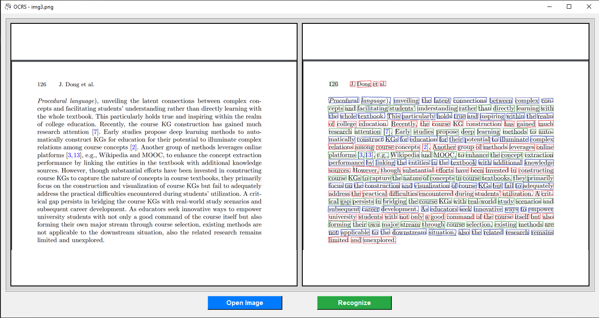

# OCRS pre-trained model 
OCRS

Link: https://github.com/robertknight/ocrs
## Datasets

The models are trained exclusively on datasets which are a) open and b) have non-restrictive licenses. This currently includes:
- [HierText](https://github.com/google-research-datasets/hiertext) (CC-BY-SA 4.0)

## Pre-trained models

Pre-trained models are available from [HuggingFace](https://huggingface.co/robertknight/ocrs) as PyTorch checkpoints,
[ONNX](https://onnx.ai) and [RTen](https://github.com/robertknight/rten) models.

### Install :
- git clone https://github.com/robertknight/ocrs.git

### Demo application:
[text](https://drive.google.com/file/d/19jF74UDgU-K7vKYyodfj-n6KT-Ei8oUA/view?usp=sharing)